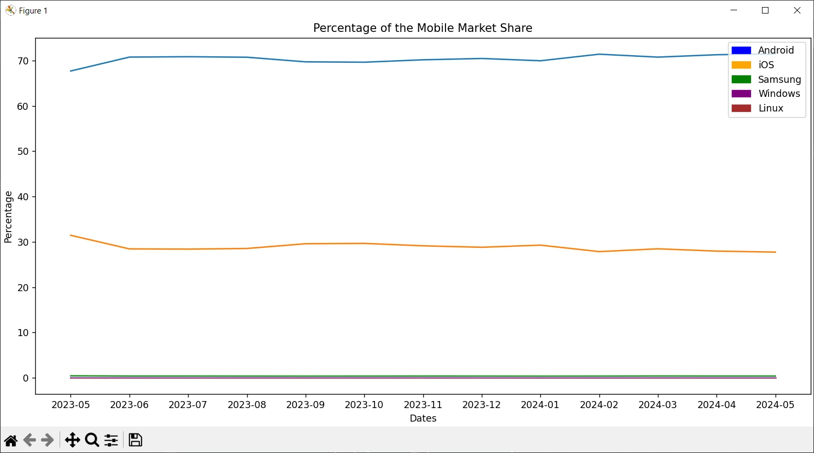
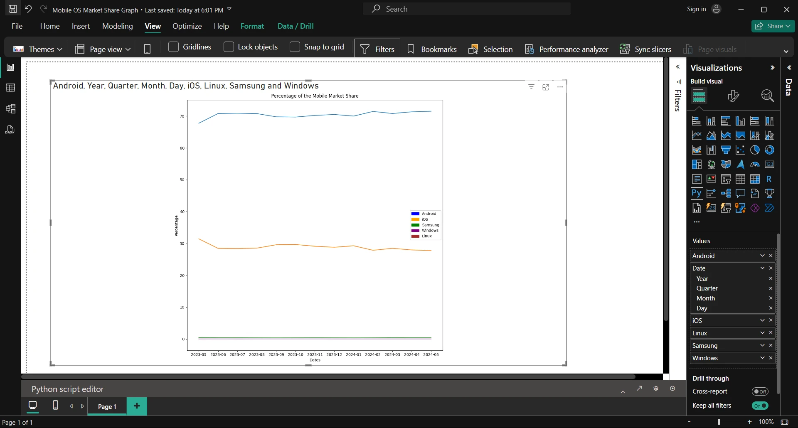

# Mobile OS Market Share Graph
Program to display a graph of the mobile OS market share.

## Data Source
The Mobile OS market share comes from StatCounter at 
[Mobile Operating System Market Share Worldwide - StatCounter](https://gs.statcounter.com/os-market-share/mobile/worldwide).
